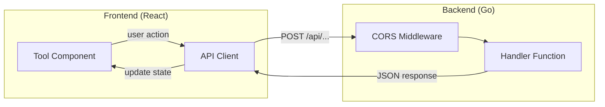

# Digital Leatherman Architecture

## Key Files

| Layer | Path | Purpose |
|-------|------|---------|
| Backend handlers | `backend/handlers/*.go` | Tool logic (string.go, json.go, lorem.go, uuid.go) |
| Routes | `backend/main.go` | Route registration with CORS wrapper |
| Middleware | `backend/middleware/*.go` | Logging, recovery |
| Frontend API | `frontend/src/api/*.ts` | API clients (stringTools.ts, jsonTools.ts, etc.) |
| Tool components | `frontend/src/components/*Tools.tsx` | UI components (StringTools, JsonTools, etc.) |
| Sidebar config | `frontend/src/config/sidebarConfig.ts` | Navigation structure |

## Architecture



## Request Flow

1. User interacts with tool component (`*Tools.tsx`)
2. Component calls API function from `frontend/src/api/*.ts`
3. API function sends POST request to `/api/{category}/{action}`
4. Backend handler in `backend/handlers/*.go` processes request
5. Handler returns JSON response via `writeJSON()`
6. Component updates state with result

## URL Pattern

Routes follow `/api/{category}/{action}`:

```
/api/string/url-encode
/api/string/base64-encode
/api/json/minify
/api/json/path
/api/uuid/generate-v4
/api/lorem-ipsum/sentences
```

## Pattern Summary

| Area | Pattern | Detailed Skill |
|------|---------|----------------|
| Backend handlers | POST-only, `decodeBody()` + `writeJSON()` | [go-handler-patterns](../go-handler-patterns/SKILL.md) |
| Frontend components | Config-driven `ToolConfig` array | [react-tool-component](../react-tool-component/SKILL.md) |
| Adding new tools | Full workflow checklist | [add-tool](../add-tool/SKILL.md) |

## Quick Reference

**Backend handler skeleton:**

```go
func MyTool(w http.ResponseWriter, r *http.Request) {
    req, ok := decodeBody(w, r)
    if !ok {
        return
    }
    result := process(req.Value)
    writeJSON(w, StringResponse{Result: result})
}
```

**Frontend tool config:**

```typescript
{
  id: 'my-tool',
  label: 'My Tool',
  description: 'What this tool does.',
  example: { input: 'sample', output: 'result' },
  placeholder: 'Enter text…',
  buttonLabel: 'Process',
  apiFn: myToolApi,
}
```
